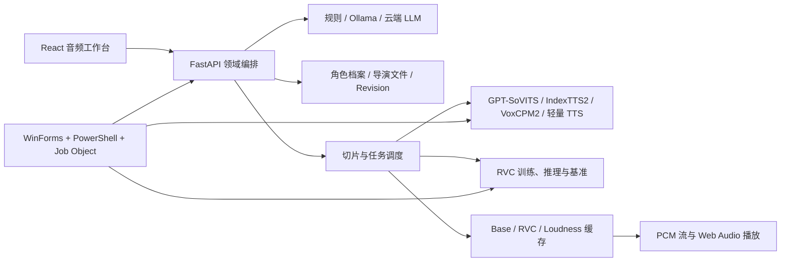
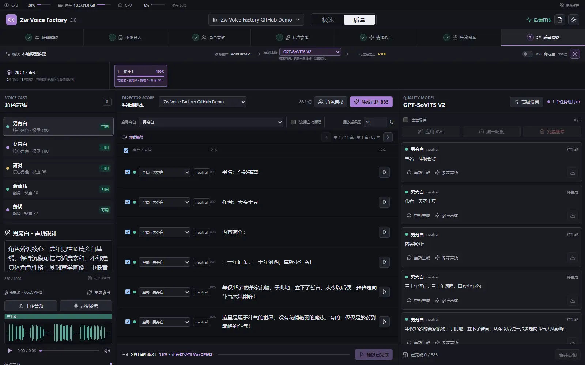
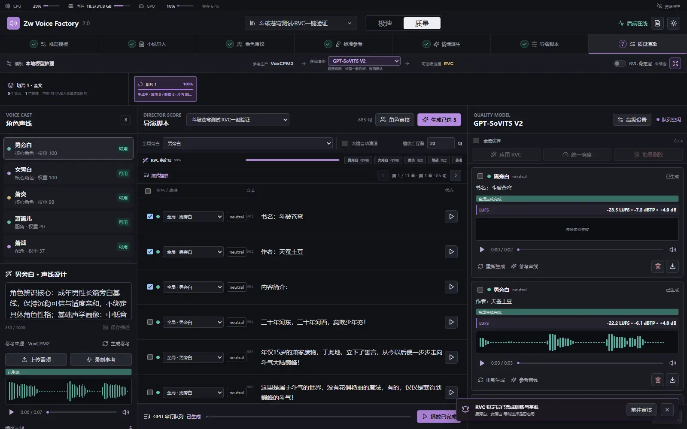
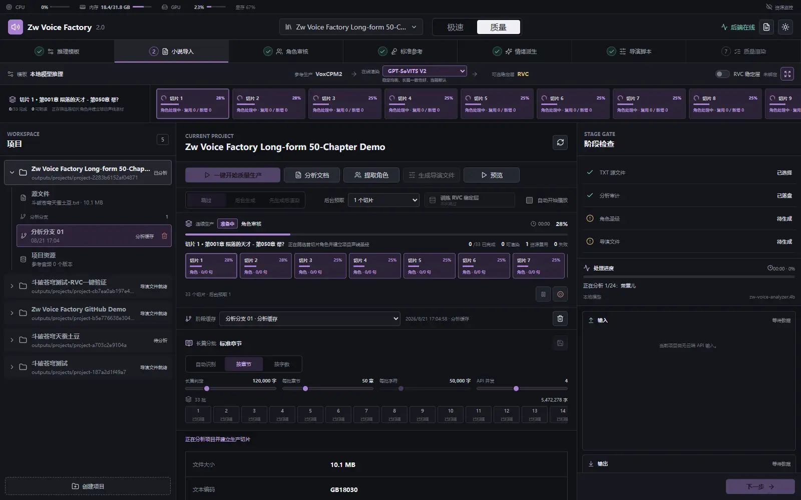
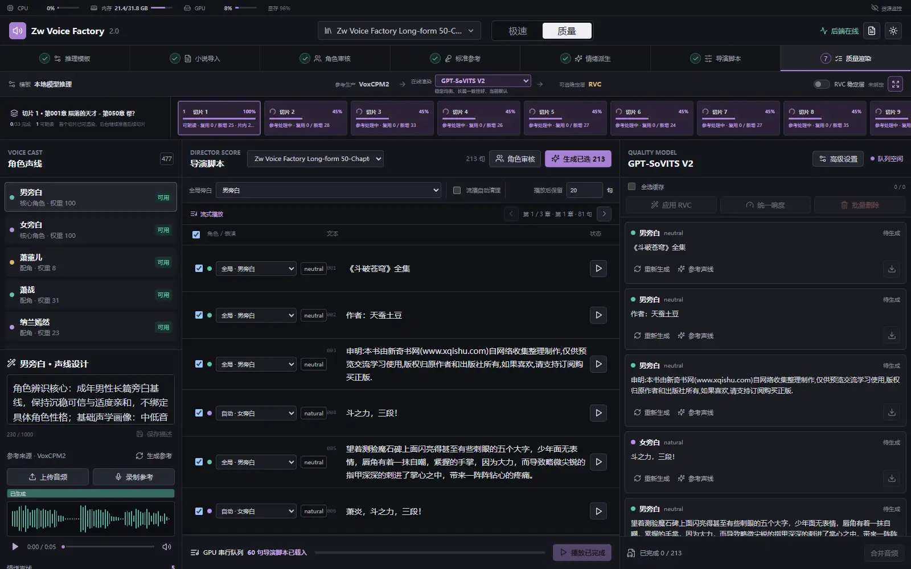
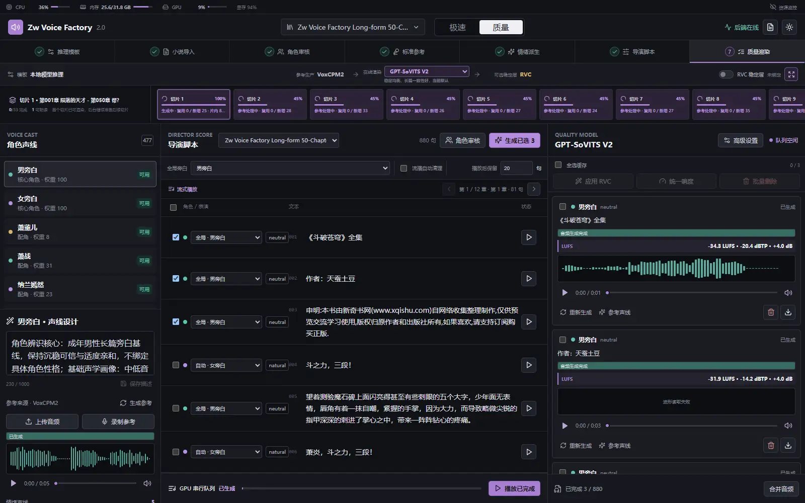

# Zw Voice Factory

Zw Voice Factory 是一个面向长篇小说的 Local-first 多角色配音生产工作站：从文本分析、角色审核、参考音频制作，到导演文件、连续切片生产、流式试听、RVC 音色稳定和节目级响度处理，全部在一个受启动器管理的项目中完成。

它的重点不是封装一个 TTS 接口，而是把长篇有声内容生产中最容易失控的环节组织起来：角色身份跨章节复用、说话人和情绪分离、首个切片尽早可用、失败后按阶段恢复，以及本地多模型进程的可观测管理。

> 项目适合展示 AI 应用工程、长任务编排、音频处理和 Windows 本地运行时治理能力。GPT-SoVITS、VoxCPM2、IndexTTS2、Ollama 和 RVC 是接入的第三方模型或工具，不是本项目自研的基础模型。

## 文档入口

- [中文使用说明](使用说明.md)：从安装、模型下载、启动器到完整配音流程的操作手册。
- [架构与技术复盘](docs/PROJECT_RESUME_AND_INTERVIEW.md)：技术栈、架构取舍、简历项目经历和模拟面试问答。
- [架构基线](docs/architecture.md)：角色资产、导演文件、渲染路线和缓存边界。
- [模型下载源](docs/model-download-sources.md)：公开模型来源、校验和发布许可边界。

## 演示视频

[观看/下载演示视频](docs/demo/Zw_Voice_Factory_demo.mp4)（约 49 秒，无背景音乐）

视频使用项目真实测试流程的脱敏截图剪辑，展示小说导入、文本分析、角色与导演文件、质量渲染、音频结果，以及长篇切片后台准备。模型权重、小说原文和音频缓存未进入视频或仓库。

项目目前以 Windows 本地部署为目标。模型权重、小说原文、参考音频、生产缓存和 API 凭据均不进入 Git；公开仓库只保存应用源码、配置模板、下载索引和设计文档。

## 核心能力

- 三种文本分析模式：云端 API、本地粗筛后云端精析、本地模型分析。
- 长篇按用户设定的章节数切片，已完成切片可以先进入质量渲染，后续切片在后台准备。
- 角色候选审计、别名归并、角色声线画像、导演文件和参考文本的可审核版本。
- 质量路线支持 GPT-SoVITS V1/V2/V2 Pro/V2 Pro Plus/V3/V4 与 IndexTTS2；极速路线支持轻量 TTS + RVC。
- 参考音频历史、复用、试听、真实波形、音频缓存清理和节目级响度统一。
- RVC 异步训练、训练进度、日志、试听对比，以及启动器统一管理的进程生命周期。
- 图形启动器、模型下载队列、断点续传、来源故障转移、SHA-256 校验和安全压缩包解压。

## 要解决的问题

长篇小说配音通常不是单次生成问题：小说会出现大量角色、别名、嵌套对白和跨章节角色变化；一次性分析整本书又会带来输入过大、角色权重失真、失败重做和首次等待时间过长等问题。直接生成的音频还可能出现角色错配、音色漂移、句间停顿和节目音量不统一。

本项目将流程拆成可审核的领域资产：

```text
小说文本
  -> 章节结构与切片
  -> 角色候选、别名、证据与重要度
  -> Character Voice Bible（角色长期身份）
  -> 标准参考与情绪派生
  -> Director Document（句子级说话人和表演）
  -> 极速路线或质量路线
  -> Base / RVC / Loudness 音频缓存
  -> 流式试听与节目导出
```

角色长期身份和句子级表演分开保存，因此修改某句情绪或说话人时，不会静默覆盖整个角色的声线设定。

## 工作流设计

### 三种文本分析模式

1. **完全云端**：把必要文本证据交给云端 API，适合追求更强文本理解且接受文本出站的场景。
2. **本地初筛后云端**：先用项目内 Ollama 模型快速筛掉明显错误角色，再把紧凑证据包交给云端精析，适合长篇。
3. **完全本地**：由 Ollama 与规则分析器完成角色、声线和导演推理，适合隐私优先或离线场景。

云端配置支持多个 OpenAI-compatible API、连接小文本探针、并发设置和 P1/P2 故障转移。结构化输出经 Pydantic 校验，错误响应不会直接污染角色资产。

### 两条语音路线

**质量路线**使用已审核的标准参考音频驱动 GPT-SoVITS 或 IndexTTS2，适合重点角色和正式输出。**极速路线**使用轻量 TTS 先快速生成，再按角色接入 RVC Identity Layer，适合快速预览和大量低权重角色。

两条路线共享角色档案、导演脚本和参考资产。质量路线还可以选择 RVC Stability Layer，但训练完成后必须经过基准试听和人工审核，失败时保留 Base Render，不让可选稳定层阻塞生产。

### 长篇连续生产

长文本可以按用户设置的章节数切片，例如 50 章一批；没有稳定章节标题时，按字符量并尽量落在完整句边界。每个切片独立保存分析、角色、参考、导演和生成状态：

- 第一切片达到 render-ready 后即可进入质量渲染。
- 后续切片在后台滚动准备，不要求整本先分析完。
- 相同角色通过角色身份和资源指纹复用，不重复生成参考音频。
- 切片支持暂停、继续、重试、跳过和终止。
- 一键流程支持在后台同步准备 RVC 稳定层，训练完成后再由用户选择是否启用。

### 音频生产与可观测性

工作台通过 Web Audio 调度句级 PCM 音频：当前句播放时准备下一句，支持从指定句开始流式播放。缓存分为原始 TTS、RVC 派生和响度派生，调整 RVC 或响度策略时不需要重复请求 TTS。

启动器统一管理模型加载进度、服务健康、API 阶段、RVC 训练日志和子进程生命周期。关闭启动器会通过 Windows Job Object 回收托管服务，避免“服务还在运行但启动器已失联”。

## 架构概览



项目目录中的源码按前端工作台、FastAPI 领域层、模型 Worker、启动器、脚本和文档分层；模型、小说、音频和生产缓存由 `.gitignore` 排除。

## 项目优势

- **从 Demo 走向生产流程**：覆盖导入、分析、审核、参考、导演、渲染、试听和导出，而不是单个模型调用页面。
- **身份与表演解耦**：Character Voice Bible 负责角色长期声线，Director Document 负责句子级说话人和表演指令。
- **首片优先的长篇策略**：把“整本分析完成后才能试听”改成“首个切片先可用，后续切片后台准备”。
- **资源可追溯和可复用**：参考音频、历史版本、RVC 模型和三层音频缓存有来源、状态和指纹。
- **可选质量稳定层**：RVC 训练不直接覆盖质量路线，使用基准与人工审核控制音质回归风险。
- **本地优先和可运维**：项目盘存储模型与缓存，启动器提供加载进度、诊断日志、单实例检查和进程回收。
- **模型适配而非模型绑定**：同一个角色资产可以在质量和极速路线之间复用，具体模型由渲染策略选择。

## 实测流程

小文本使用 `input/斗破苍穹测试.txt` 验证完整链路：文件约 64.5 KB，正文 33,623 字、11 章；从项目创建、文本分析、角色审核、参考音频、导演文件到质量渲染均通过，导演文件包含 883 句。首个质量渲染切片使用 GPT-SoVITS V2，实际生成的试听任务均完成，并记录节目级响度校正指标。





长文本使用 `input/斗破苍穹天蚕土豆.txt` 验证流式切片：文件约 10.1 MB，正文 5,472,278 字、1,646 章；设置为每 50 章一批后生成 33 个切片。第 1 切片（第 1 至 50 章）先进入质量渲染，第 2 至第 9 切片继续在后台准备参考音频；首切片随后完成 3 个真实质量音频试听任务，后续切片保持可追踪的处理状态。







这组截图只展示脱敏后的本地测试状态；小说原文、模型、音频和运行缓存均被 `.gitignore` 排除，不会随仓库发布。

实测结果说明了当前系统的能力边界：小文本链路已经可以从导入走到真实质量音频；长文本已经可以按 50 章一批滚动切片并让首片先进入渲染，但角色候选精筛和跨体裁识别仍需要继续用黄金文本评估，不能把截图当成“所有小说都能自动正确分角”的承诺。

## 技术栈

| 层 | 技术 |
| --- | --- |
| 前端 | React 18、TypeScript、Vite、TanStack Query、Zustand、WaveSurfer.js、Lucide |
| 后端 | Python、FastAPI、Pydantic、Uvicorn、pytest |
| 模型工作进程 | GPT-SoVITS、VoxCPM2、IndexTTS2、RVC、Ollama |
| 启动与资源管理 | PowerShell、Windows Job Object、C# WinForms、.NET 8 |
| 音频处理 | FFmpeg、响度测量与节目级归一化 |

## 目录结构

```text
backend/                 FastAPI 路由、领域契约、分析与生产任务
frontend/                React + TypeScript 工作台
launcher/                中文图形启动器源码
model_workers/           TTS、RVC 和运行日志工作进程
scripts/                 启动、测试、构建和音频工具脚本
config/                  模型下载目录与配置模板
skills/                  本地文本分析约束与属性词规范
docs/                    架构、ADR、领域模型与发布说明
assets/                  本地参考音频和 RVC 资产，不纳入 Git
models/                  本地模型和工具，不纳入 Git
input/                   小说原文，不纳入 Git
outputs/                 项目、音频、日志和缓存，不纳入 Git
```

## 发布边界

GitHub 仓库只保存源码、配置模板、公开下载索引、脱敏截图和设计文档。模型权重、第三方运行环境、小说原文、参考音频、RVC 资产、生产缓存、日志和 API Key 均不发布。部署者通过启动器模型管理按需下载公开资源，并自行确认上游模型和音频资产的许可证。

## 快速开始

以下命令均在仓库根目录执行。Windows PowerShell、Python 3.11+、Node.js 20+ 和 .NET 8 SDK 是基础环境；质量路线和 RVC 还需要对应的模型工具与显卡环境。

```powershell
git clone <仓库地址>
cd Zw_Voice_factory

python -m venv backend\.venv
backend\.venv\Scripts\python.exe -m pip install -r backend\requirements-dev.txt
npm.cmd --prefix frontend ci

.\scripts\setup_audio_tools.ps1
.\Start-ZwVoice.cmd setup-analyzer
```

首次部署打开 `ZwVoiceFactoryLauncher.exe`，进入“模型管理”，按需选择公开模型源下载资源。默认目录是 `config/model_catalog.json`；个人镜像和自定义下载项写入被 Git 忽略的 `config/model_catalog.local.json`。模型管理器显示来源地址，支持断点续传、重试、故障转移和校验。

## 启动、状态与测试

图形启动器和 CMD 启动器共享同一个可见的服务所有者。不要直接启动 Vite、FastAPI 或模型工作进程，这会绕过进度显示和进程清理。

```powershell
.\Start-ZwVoice.cmd run
.\Start-ZwVoice.cmd status
.\Start-ZwVoice.cmd stop
.\Start-ZwVoice.cmd test
```

`run` 会打开 WebUI `http://127.0.0.1:5173/`；启动器负责模型预加载、云端/本地分析进度、服务日志和 Windows Job Object 清理。`test` 通过同一启动器链路运行后端测试、前端生产构建和运行时端点检查。修改图形启动器源码后运行：

```powershell
powershell.exe -NoProfile -ExecutionPolicy Bypass -File .\scripts\build_gui_launcher.ps1
```

日志位于被忽略的 `outputs/logs/`，RVC 训练日志按任务写入 `outputs/logs/rvc/`。启动器和 WebUI 都可以查看或导出诊断信息。

## 公开发布边界

仓库不携带模型权重、模型工具的虚拟环境、小说输入、音频资产、生产输出或 API 密钥。部署者需要通过模型管理器下载公开资源，并在本地配置云端 API。模型下载地址和许可信息见 `docs/model-download-sources.md`。

代码结构、领域术语、关键架构决策和当前限制见：

- `CONTEXT.md`：领域模型与术语边界。
- `docs/architecture.md`：模块关系和数据流。
- `docs/adr/`：持续生产、响度、RVC 等关键决策记录。
- `docs/PROJECT_RESUME_AND_INTERVIEW.md`：适合项目展示和面试复盘的技术说明。
- `docs/release-inventory.md`：源码统计、资源体积和发布检查清单。

## 当前限制

这是一个需要本地模型与音频工具配合的工程，不是下载后即可运行的纯前端 Demo。不同模型的显存、依赖和许可证不同；模型目录只提供来源索引，不替代上游模型的许可证。长篇分析、云端 API 并发和 RVC 训练的耗时取决于文本规模、网络、显卡和用户配置。

目前仍需要持续改进的方向包括：角色候选合并的准确率、真实 GPU 模型的可重复基准、浏览器端 E2E 测试、结构化事件推送，以及将部分 JSON Manifest 元数据迁移到 SQLite。项目文档会主动保留这些事实边界，避免把架构目标或局部实测误写成已经完成的商业化能力。
